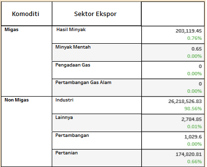

# DASISEBAR 2020
DASISEBAR 2020 adalah dashboard informasi yang memuat visualisasi data sosial ekonomi Provinsi Jawa Barat tahun 2020. Dashboard ini dibuat dengan tujuan untuk memberi kemudahan dalam melihat perkembangan kondisi sosial ekonomi Provinsi Jawa Barat dengan menggunakan visualisasi berbentuk dashboard informasi dan membantu pemerintah untuk mengambil keputusan.
  
Hasil dari dashboard dapat dilihat melalui link dibawah ini.

<a href="https://public.tableau.com/app/profile/fitri.nurul.fadliah/viz/DashboardSosialEkonomiProvinsiJawaBarat/Sosial">Dashboard Informasi Sosial Ekonomi Provinsi Jawa Barat 2020</a>

## Analisis Kebutuhan
Analisis kebutuhan informasi merupakan tahapan mencari informasi dimana informasi tersebut dijadikan sebagai batasan untuk ditampilkan di dalam dashboard, sehingga informasi yang ditampilkan sesuai dengan tujuan penelitian. Berikut adalah  kebutuhan informasi yang dibutuhkan dalam dashboard informasi yang menggambarkan keadaan sosial ekonomi Provinsi Jawa Barat:
<ul>
   <li>Melihat jumlah wilayah administrasi</li>
   <li>Melihat kondisi Indeks Pembangunan Manusia (IPM) per Kabupaten/Kota</li>
   <li>Melihat komposisi penduduk menurut usia dan jenis kelamin</li>
   <li>Melihat jumlah fasilitas kesehatan dan pendidikan</li>
   <li>Melihat persentase jumlah penduduk menurut jenis kelamin</li>
   <li>Melihat angka TPAK, TPT dan persentase penduduk miskin</li>
   <li>Melihat fluktuasi inflasi bulanan</li>
   <li>Melihat pertumbuhan PDB per triwulan</li>
   <li>Melihat PDB menurut pengeluaran dan Lapangan Usaha</li>
   <li>Melihat komposisi nilai ekspor dan impor menurut sektor</li>
</ul>

## Dataset 
Data yang digunakan dalam penelitian ini berasal dari data publikasi Badan Pusat Statistik (BPS) Provinsi Jawa Barat (<a href="https://www.bps.go.id/">bps.go.id</a>) tahun 2020. Data yang digunakan adalah sebagai berikut:
1.	Indeks Pembangunan Manusia (IPM)
2.	Proyeksi Penduduk menurut usia dan jenis kelamin
3.	Jumlah Wilayah Administrasi
4.	Jumlah Fasilitas Pendidikan
5.	Jumlah Fasilitas Kesehatan
6.	Jumlah Penduduk menurut Jenis Kelamin
7.	TPAK dan TPT 
8.	Persentase penduduk miskin
9.	Inflasi
10.	Pertumbuhan PDB
11.	PDB menurut Lapangan Usaha
12.	PDB menurut Pengeluaran
13.	Nilai Ekspor 
14.	Nilai Impor

## Jenis Visualisasi
Berdasarkan kebutuhan informasi dan data yang tersedia, berikut adalah visualisasi yang digunakan dalam penelitian ini, diantaranya:
<ol type="a">
   <li>Simple text</li>
      Simple text adalah bentuk visualisasi yang hanya menampilkan beberapa angka untuk di visualisasikan.
   <li>Choropleth Map</li>
      Choropleth Map adalah salah satu visualisasi data yang memiliki variabel geografis dan menggunakan warna-warna yang berbeda antar daerah. 
   <li>Piramida Penduduk</li>
      Piramida penduduk adalah grafik khusus untuk menampilkan komposisi umur dan jenis kelamin dari suatu populasi.
   <li>Bar Chart</li>
      Bar chart adalah grafik atau diagram yang cocok untuk data kategorik. Bar chart digunakan untuk membandingkan data antar kategori dan untuk melihat frekuensi dari kategori tersebut.
   <li>Doughnut Chart dan Pie Chart</li>
      Doughnut Chart dan Pie Chart adalah jenis visualisasi data yang berbentuk lingkaran yang cocok digunakan untuk data yang bersifat kategorik yang mewakili angka dalam bentuk persentase dan jumlah semua bagian harus sama dengan 100%.
   <li>Line Chart</li>
      Line chart atau grafik garis adalah salah satu visualisasi data yang pada umumnya digunakan untuk ilustrasi trend atau menggambarkan hubungan data dalam periode waktu tertentu.
   <li>Tabel</li>
      Tabel adalah salah satu visualisasi yang mengkomunikasikan informasi berupa nama dan bilangan yang tersusun dalam urutan kolom dan baris.
</ol>    

## Hasil Visualisasi
Berikut beberapa hasil visualisasi data yang sesuai dengan kebutuhan informasi.
<ol type="a">
   <li><i>Simple text</i></li>
      

      
       
Gambar 1. Tampilan visualisasi <i>simple text</i>

      

   <li><i>Choropleth Map</i></li>
       

      
       
Gambar 2. Tampilan visualisasi <i>choropleth map</i>

      

   <li>Piramida Penduduk</li>
      

      
       
Gambar 3. Tampilan visualisasi piramida penduduk

      

   <li><i>Bar Chart</i></li>
      

      
       
Gambar 4. Tampilan visualisasi <i>bar chart</i>

      

   <li><i>Doughnut Chart</i> dan <i>Pie Chart</i></li>
      

      
       
Gambar 5. Tampilan visualisasi <i>doughnut chart</i>

      

   <li><i>Line Chart</i></li>
      

      
       
Gambar 6. Tampilan visualisasi <i>line chart</i>

      

   <li>Tabel</li>
      

      
       
Gambar 7. Tampilan visualisasi tabel

      

</ol>

## Dashboard Informasi
Setelah dilakukan visualisasi sesuai kebutuhan informasi, dibangunlah sistem dashboard informasi. Dashboard informasi yang dihasilkan memiliki 2 fitur yaitu fitur sosial dan fitur ekonomi.

 
Gambar 8. Tampilan dashboard informasi bagian sosial

 
 
Gambar 9. Tampilan dashboard informasi bagian ekonomi

## Kesimpulan
Dashboard informasi ini menampilkan visualisasi keadaan sosial dan keadaan ekonomi Provinsi Jawa Barat pada tahun 2020. Dengan adanya dashboard informasi ini diharapkan dapat membantu masyarakat umum untuk mengetahui keadaan sosial ekonomi di Jawa Barat dan dapat membantu pemerintah dalam mengambil keputusan dan membuat rancangan kebijakan di tahun setelahnya.

(<a href="#top">back to top</a>)

## Kontak

Fitri Nurul Fadliah - fitrinurulfadliah31@gmail.com

